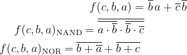
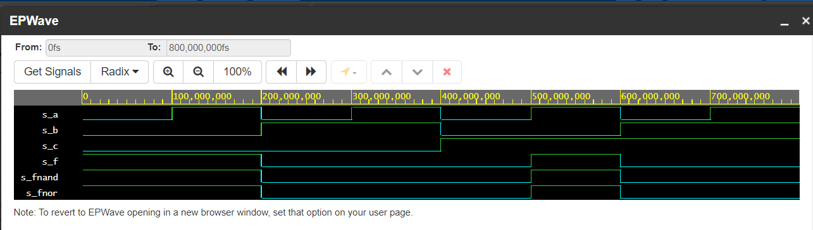
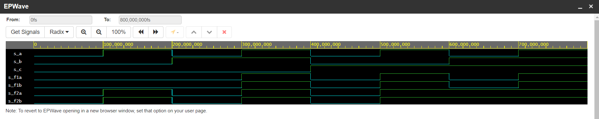

# Laboratory 1: Tools

More information on [GitHub Tomáš Frýza](https://github.com/tomas-fryza/Digital-electronics-1/tree/master/Labs/01-gates)

[My GitHub](https://github.com/PetrDockalik/Digital-electronics-1)

## Description of laboratory

| **Operator** | **Description** |
| :-: | :-- |
| `<=` | Value assignment |
| `and` | Logical AND |
| `nand` | Logical AND with negated output |
| `or` | Logical OR |
| `nor` | Logical OR with negated output |
| `not` | Nagation |
| `xor` | Exclusive OR |
| `xnor` | Exclusive OR with negated output |
| `-- comment` | Comments |

```LaTeX
\begin{align*}
    f(c,b,a) =&~ \overline{b}\,a + \overline{c}\,\overline{b}\\
    f(c,b,a)_{\textup{NAND}} =\overline{\overline{a\cdot \overline{b}}\cdot \overline{\overline{b}\cdot \overline{c}}}\\
    f(c,b,a)_{\textup{NOR}} =\overline{b+ \overline{a}}+\overline{b+c}\
\end{align*}
```



| **c** | **b** |**a** | **f(c,b,a)** | **fNAND** | **fNOR** |
| :-: | :-: | :-: | :-: | :-: | :-: |
| 0 | 0 | 0 | 1 | 1 | 1 |
| 0 | 0 | 1 | 1 | 1 | 1 |
| 0 | 1 | 0 | 0 | 0 | 0 |
| 0 | 1 | 1 | 0 | 0 | 0 |
| 1 | 0 | 0 | 0 | 0 | 0 |
| 1 | 0 | 1 | 1 | 1 | 1 |
| 1 | 1 | 0 | 0 | 0 | 0 |
| 1 | 1 | 1 | 0 | 0 | 0 |

```
entity gates is
    port(
        a_i    : in  std_logic;         -- Data input
        b_i    : in  std_logic;         -- Data input
        c_i    : in  std_logic;         -- Data input
        f_o  : out std_logic;         -- normal output function
        fNAND_o : out std_logic;         -- NAND output function
        fNOR_o : out std_logic          -- NOR output function
    );
end entity gates;

------------------------------------------------------------------------
-- Architecture body for basic gates
------------------------------------------------------------------------
architecture dataflow of gates is
begin
    f_o  <= (not (b_i) and a_i) or( not (c_i) and not(b_i));
    fNAND_o <= not (not(a_i and not(b_i))and not(not (c_i) and not(b_i)));
    fNOR_o <= not(b_i or not(a_i)) or not(c_i or b_i);

end architecture dataflow;
```



[My Example](https://www.edaplayground.com/x/kZiU)

```
entity gates is
    port(
        a_i    : in  std_logic;         -- Data input
        b_i    : in  std_logic;         -- Data input
        c_i    : in  std_logic;         -- Data input
        f_o1a  : out std_logic;         -- output function 1
        f_o1b : out std_logic;         -- output function 1
        f_o2a : out std_logic;         -- output function 2
        f_o2b : out std_logic         -- output function 2
    );
end entity gates;

------------------------------------------------------------------------
-- Architecture body for basic gates
------------------------------------------------------------------------
architecture dataflow of gates is
begin
    f_o1a  <= (a_i and b_i) or (a_i and c_i);
    f_o1b  <= a_i and (b_i or c_i);
    f_o2a  <= (a_i or b_i) and (a_i or c_i);
    f_o2b  <= a_i or (b_i and c_i);

end architecture dataflow;
```



[My Example](https://www.edaplayground.com/x/ufQG)
