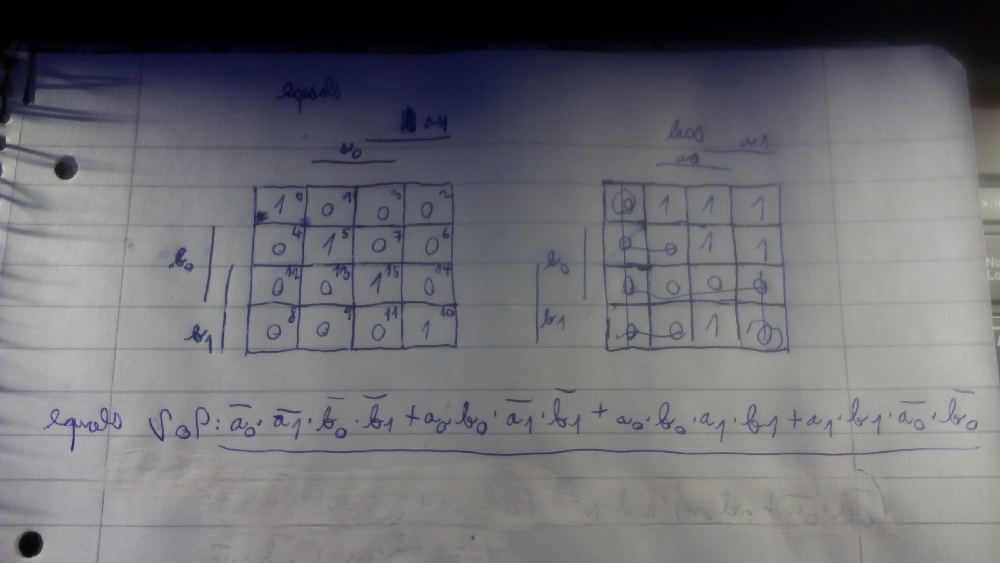

# Laboratory 2: Combinational logics

More information on [GitHub Tomáš Frýza](https://github.com/tomas-fryza/Digital-electronics-1/tree/master/Labs/02-logic)

[My GitHub](https://github.com/PetrDockalik/Digital-electronics-1)

## Preparation of Laboratory

| **Dec. equivalent** | **B[1:0]** | **A[1:0]** | **B is greater than A** | **B equals A** | **B is less than A** |
| :-: | :-: | :-: | :-: | :-: | :-: |
| 0 | 0 0 | 0 0 | 0 | 1 | 0 |
| 1 | 0 0 | 0 1 | 0 | 0 | 1 |
| 2 | 0 0 | 1 0 | 0 | 0 | 1 |
| 3 | 0 0 | 1 1 | 0 | 0 | 1 |
| 4 | 0 1 | 0 0 | 1 | 0 | 0 |
| 5 | 0 1 | 0 1 | 0 | 1 | 0 |
| 6 | 0 1 | 1 0 | 0 | 0 | 1 |
| 7 | 0 1 | 1 1 | 0 | 0 | 1 |
| 8 | 1 0 | 0 0 | 1 | 0 | 0 |
| 9 | 1 0 | 0 1 | 1 | 0 | 0 |
| 10 | 1 0 | 1 0 | 0 | 1 | 0 |
| 11 | 1 0 | 1 1 | 0 | 0 | 1 |
| 12 | 1 1 | 0 0 | 1 | 0 | 0 |
| 13 | 1 1 | 0 1 | 1 | 0 | 0 |
| 14 | 1 1 | 1 0 | 1 | 0 | 0 |
| 15 | 1 1 | 1 1 | 0 | 1 | 0 |

[Map solution](http://www.32x8.com/var4.html)




```
SoP _{equals} = \overline{a_{0}}\cdot \overline{a_{1}}\cdot \overline{b_{0}}\cdot \overline{b_{1}}\ +a_{0}\cdot \overline{a_{1}}\cdot b_{0}\cdot \overline{b_{1}}\ +a_{0}\cdot a_{1}\cdot b_{0}\cdot b_{1}\ +\overline{a_{0}}\cdot a_{1}\cdot \overline{b_{0}}\cdot b_{1}\\
PoS _{less} = (b_{1}+b_{0})\cdot (\overline{a_{0}}+\overline{a_{1}})\cdot (b_{0}+\overline{a_{1}})\cdot (b_{1}+\overline{a_{1}})\cdot (b_{1}+\overline{a_{0}})
```

## Description of laboratory

| **Port name** | **Direction** | **Type** | **Description** |
| :-: | :-: | :-- | :-- |
| `a_i`       | input  | `std_logic_vector(2 - 1 downto 0)` | Data A |
| `b_i`       | input  | `std_logic_vector(2 - 1 downto 0)` | Data B |
| `B_greater_A_o` | output | `std_logic` | B is greater than A |
| `B_equals_A_o`  | output | `std_logic` | B equals A |
| `B_less_A_o`    | output | `std_logic` | B is less than A |


 
### 2-bit comparator

[My example](https://www.edaplayground.com/x/PTJj)

https://www.edaplayground.com/x/PTJj


### 4-bit comparator

```vhdl
-- Entity declaration for 4-bit binary comparator
------------------------------------------------------------------------
entity comparator_4bit is
    port(
        a_i           : in  std_logic_vector(4 - 1 downto 0);
		b_i           : in  std_logic_vector(4 - 1 downto 0);

		B_greater_A_o : out std_logic;       -- B is greater than A
        B_equals_A_o  : out std_logic;       -- B is equals than A
        B_less_A_o    : out std_logic       -- B is less than A
    );
end entity comparator_4bit;

------------------------------------------------------------------------
-- Architecture body for 4-bit binary comparator
------------------------------------------------------------------------
architecture Behavioral of comparator_4bit is
begin
	B_greater_A_o   <= '1' when (b_i > a_i) else '0';
	B_equals_A_o   <= '1' when (b_i = a_i) else '0';
    B_less_A_o   <= '1' when (b_i < a_i) else '0';


end architecture Behavioral;
```

```vhdl
------------------------------------------------------------------------
-- Architecture body for testbench
------------------------------------------------------------------------
architecture testbench of tb_comparator_4bit is

    -- Local signals
    signal s_a      	 : std_logic_vector(4 - 1 downto 0);
    signal s_b       	 : std_logic_vector(4 - 1 downto 0);
    signal s_B_greater_A : std_logic;
    signal s_B_equals_A  : std_logic;
    signal s_B_less_A    : std_logic;

begin
    -- Connecting testbench signals with comparator_4bit entity (Unit Under Test)
    uut_comparator_4bit : entity work.comparator_4bit
        port map(
            a_i           => s_a,
            b_i           => s_b,
            B_greater_A_o => s_B_greater_A,
            B_equals_A_o  => s_B_equals_A,
            B_less_A_o    => s_B_less_A
        );

    --------------------------------------------------------------------
    -- Data generation process
    --------------------------------------------------------------------
    p_stimulus : process
    begin
        -- Report a note at the begining of stimulus process
        report "Stimulus process started" severity note;


        -- First test values
        s_b <= "0000"; s_a <= "0000"; wait for 100 ns;
        -- Expected output
        assert ((s_B_greater_A = '0') and (s_B_equals_A = '1') and (s_B_less_A = '0'))
        -- If false, then report an error
        report "Test failed for input combination: 0000, 0000" severity error;
        
        
        -- Second test values
        s_b <= "0000"; s_a <= "0001"; wait for 100 ns;
       	-- Expected output
        assert ((s_B_greater_A = '0') and (s_B_equals_A = '0') and (s_B_less_A = '1'))
        -- If false, then report an error
        report "Test failed for input combination: 0000, 0001" severity error;
        
        
        -- Third test values
        s_b <= "0000"; s_a <= "0010"; wait for 100 ns;
        -- Expected output
        assert ((s_B_greater_A = '0') and (s_B_equals_A = '0') and (s_B_less_A = '1'))
        -- If false, then report an error
        report "Test failed for input combination: 0000, 0010" severity error;
        
        
        -- Mistake test values
        s_b <= "1010"; s_a <= "0011"; wait for 100 ns;
        -- Expected output
        assert ((s_B_greater_A = '0') and (s_B_equals_A = '0') and (s_B_less_A = '1'))
        -- If false, then report an error
        report "Test failed for input combination: 1010, 0011" severity error;
        
        
        -- Fourth test values
        s_b <= "0000"; s_a <= "0011"; wait for 100 ns;
        -- Expected output
        assert ((s_B_greater_A = '0') and (s_B_equals_A = '0') and (s_B_less_A = '1'))
        -- If false, then report an error
        report "Test failed for input combination: 0000, 0011" severity error;
```     

[My example](https://www.edaplayground.com/x/8Se6)

https://www.edaplayground.com/x/8Se6


