# Laboratory 3 - Vivado

[Nexys FPGA](https://reference.digilentinc.com/reference/programmable-logic/nexys-a7/start)

More information on [GitHub Tomáš Frýza](https://github.com/tomas-fryza/Digital-electronics-1/tree/master/Labs/03-vivado)

[My GitHub](https://github.com/PetrDockalik/Digital-electronics-1)

## Preparation of Laboratory

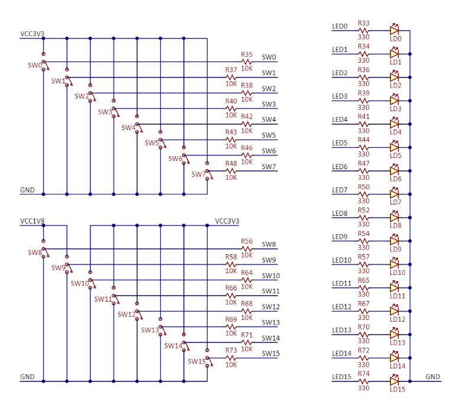

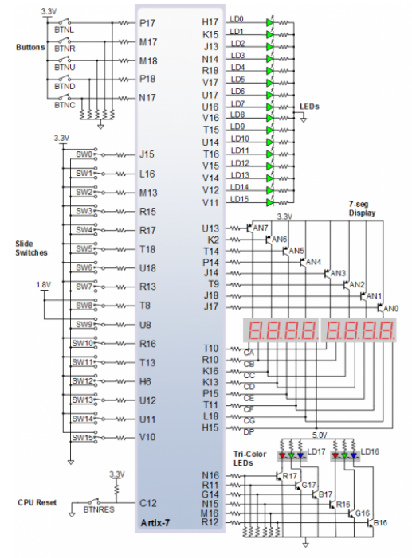

[Install Vivado](https://github.com/tomas-fryza/Digital-electronics-1/wiki/How-to-Install-Vivado-2020.2-on-Windows)

[Creating project](https://blog.digilentinc.com/creating-and-programming-our-first-fpga-project-part-2-initial-project-creation/)

## Laboratory - Multiplexer

[Comparator_4](https://www.edaplayground.com/x/8Se6)

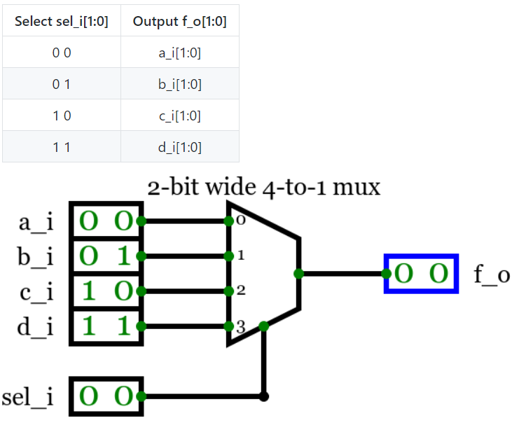

```vhdl
------------------------------------------------------------------------
architecture Behavioral of mux_2bit_4to1 is
begin
f_o <= a_i when (sel_i = "00") else
       b_i when (sel_i = "01") else
       c_i when (sel_i = "10") else
       d_i;

end architecture Behavioral;
```

```vhdl
--------------------------------------------------------------------
    p_stimulus : process
    begin
        -- Report a note at the begining of stimulus process
        report "Stimulus process started" severity note;

        s_a <= "00"; s_b <= "10"; s_c <= "00"; s_d <= "00";
        s_sel <= "01"; wait for 100 ns;
        
        s_a <= "00"; s_b <= "00"; s_c <= "01"; s_d <= "00";
        s_sel <= "10"; wait for 100 ns;
        
        s_a <= "11"; s_b <= "01"; s_c <= "01"; s_d <= "10";
        s_sel <= "00"; wait for 100 ns;
        
        s_sel <= "01"; wait for 100 ns;
   
        s_sel <= "10"; wait for 100 ns;
        
        s_sel <= "11"; wait for 100 ns;

        -- Report a note at the end of stimulus process
        report "Stimulus process finished" severity note;
        
        wait;
    end process p_stimulus;
```

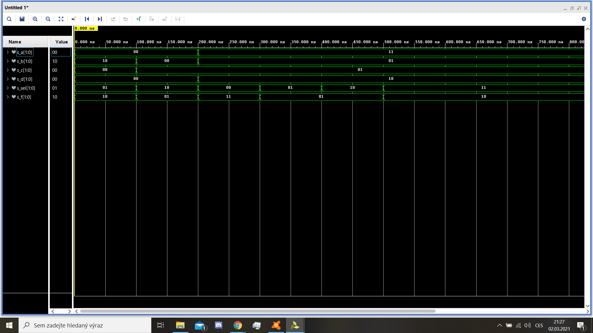

# Tutorial

### Step 1

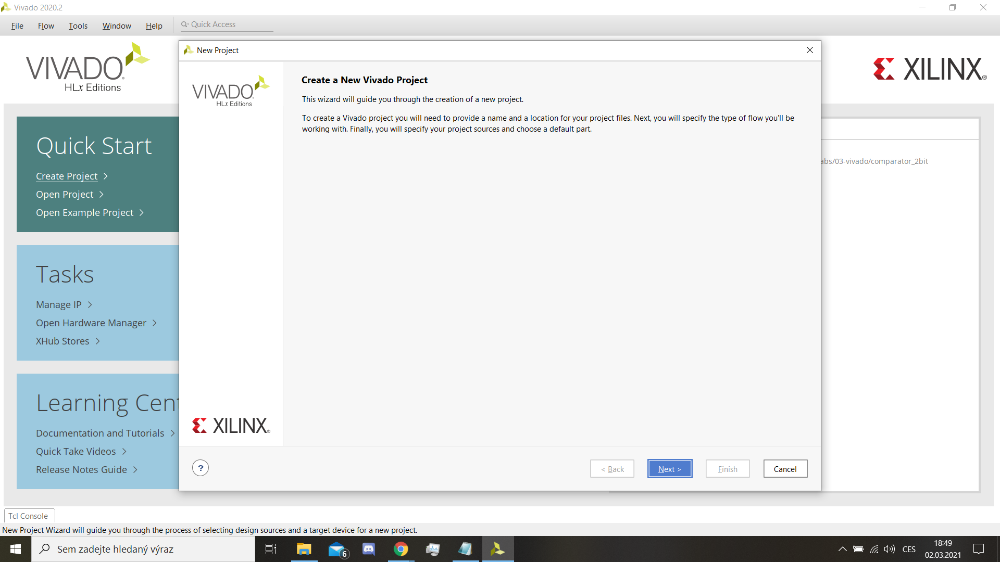

### Step 2

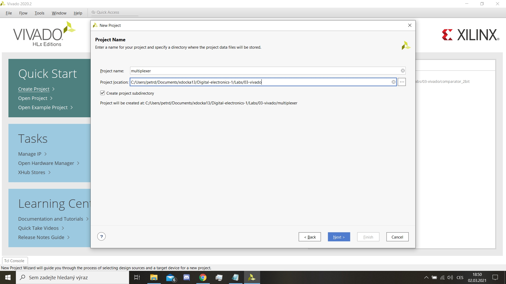

### Step 3

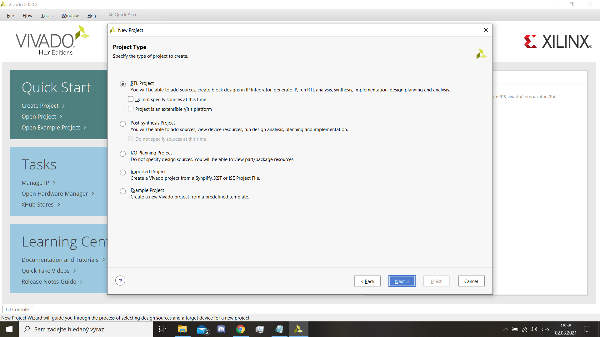

### Step 4

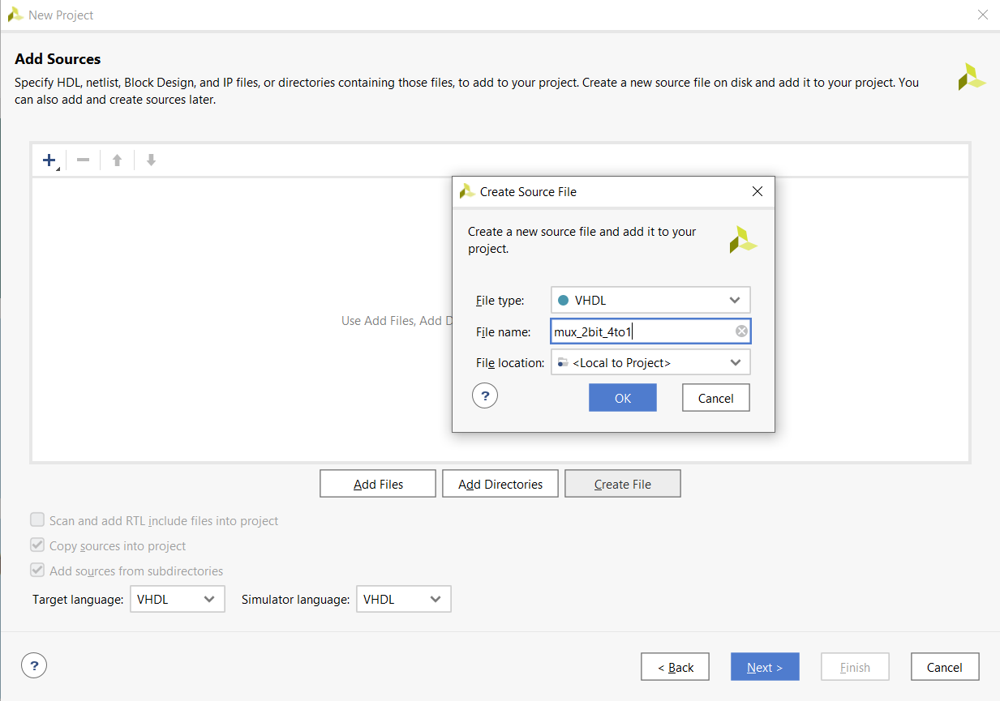

### Step 5

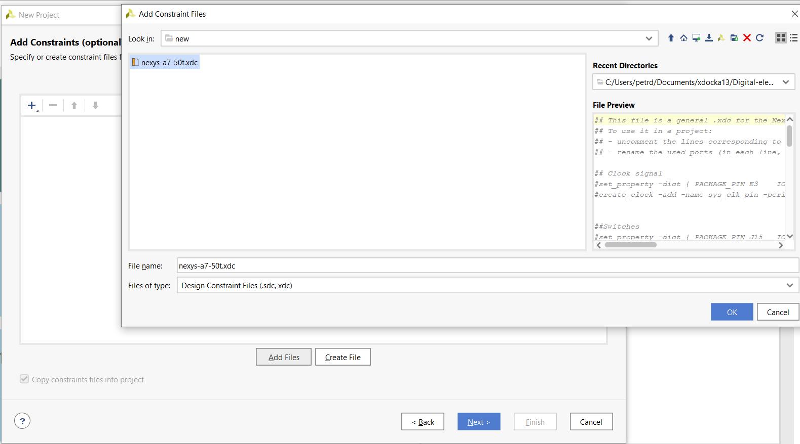

### Step 6

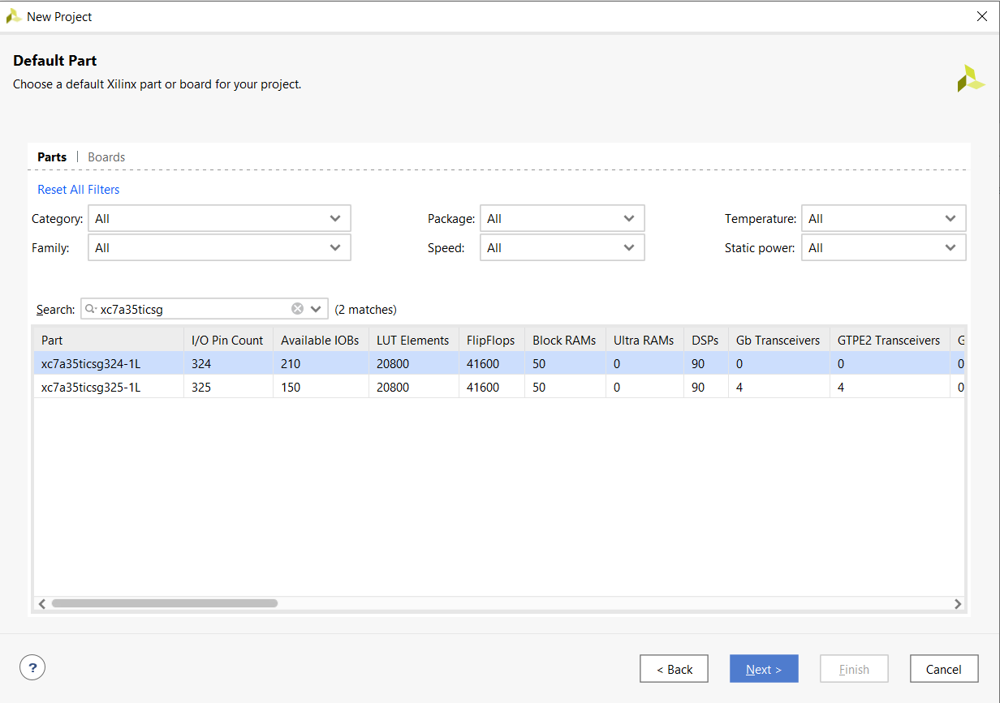

### Step 7

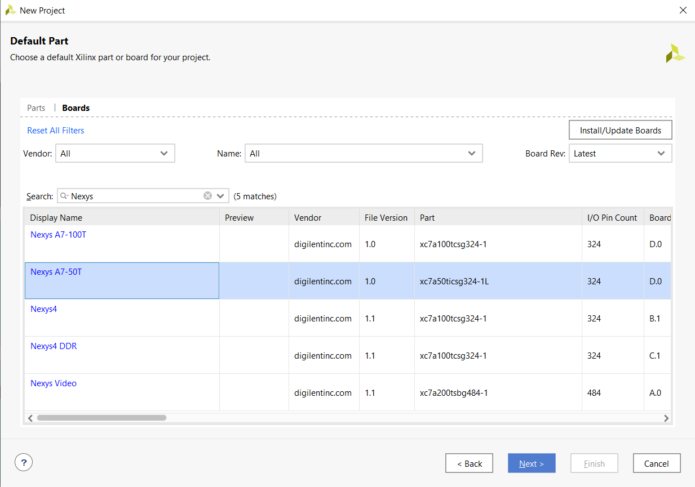

Other tables must give "Ok" or "Yes".

### Step 8

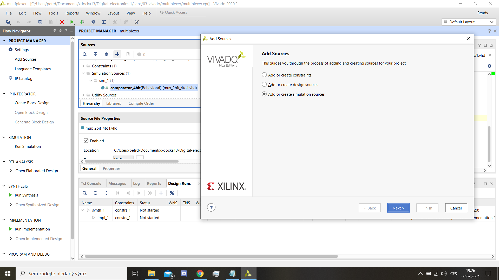

### Step 9

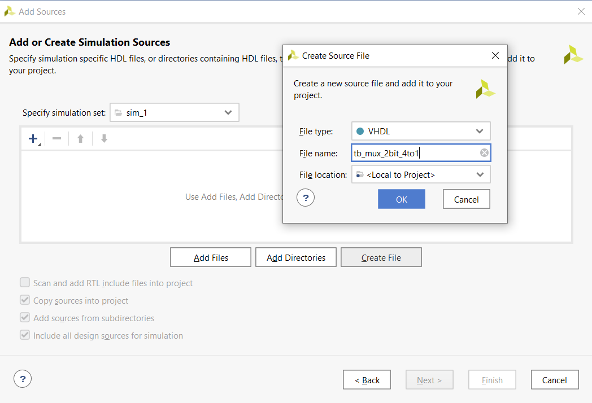