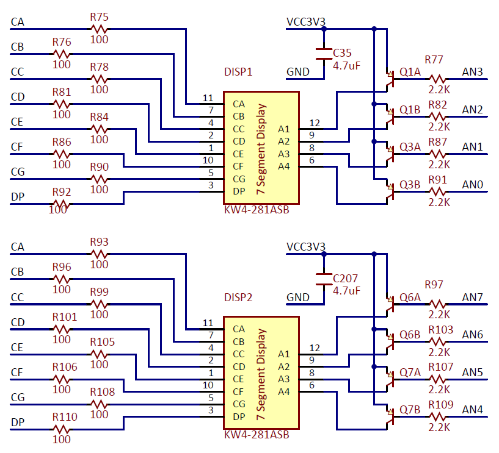
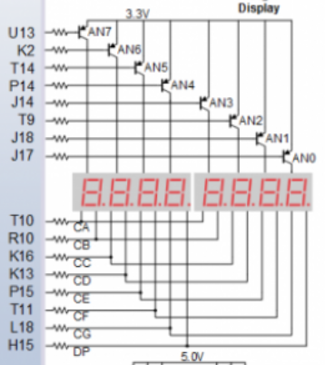
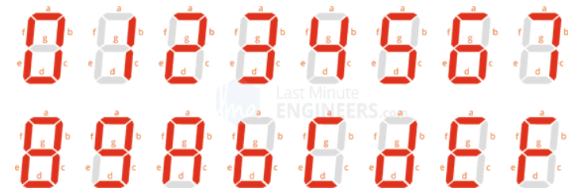
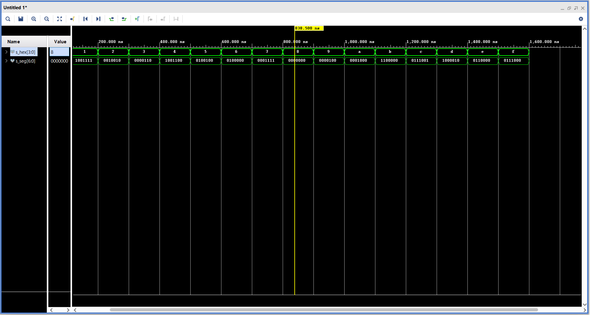
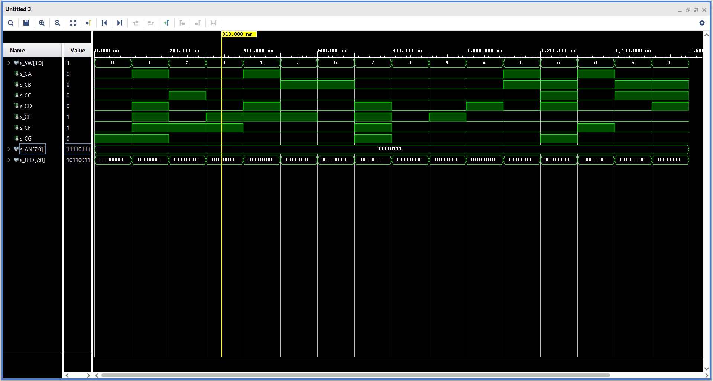

# Laboratory 4 - Seven-segment display decoder

[Nexys FPGA](https://reference.digilentinc.com/reference/programmable-logic/nexys-a7/start)

More information on [GitHub Tomáš Frýza](https://github.com/tomas-fryza/Digital-electronics-1/tree/master/Labs/04-segment)

[My GitHub](https://github.com/PetrDockalik/Digital-electronics-1)

## Preparation of Laboratory




| **Hex** | **Inputs** | **A** | **B** | **C** | **D** | **E** | **F** | **G** |
| :-: | :-: | :-: | :-: | :-: | :-: | :-: | :-: | :-: |
| 0 | 0000 | 0 | 0 | 0 | 0 | 0 | 0 | 1 |
| 1 | 0001 | 1 | 0 | 0 | 1 | 1 | 1 | 1 |
| 2 | 0010 | 0 | 0 | 1 | 0 | 0 | 1 | 0 |
| 3 | 0011 | 0 | 0 | 0 | 0 | 1 | 1 | 0 |
| 4 | 0100 | 1 | 0 | 0 | 1 | 1 | 0 | 0 |
| 5 | 0101 | 0 | 1 | 0 | 0 | 1 | 0 | 0 |
| 6 | 0110 | 0 | 1 | 0 | 0 | 0 | 0 | 0 |
| 7 | 0111 | 0 | 0 | 0 | 1 | 1 | 1 | 1 |
| 8 | 1000 | 0 | 0 | 0 | 0 | 0 | 0 | 0 |
| 9 | 1001 | 0 | 0 | 0 | 0 | 1 | 0 | 0 |
| A | 1010 | 0 | 0 | 0 | 1 | 0 | 0 | 0 |
| b | 1011 | 1 | 1 | 0 | 0 | 0 | 0 | 0 |
| C | 1100 | 0 | 1 | 1 | 1 | 0 | 0 | 1 |
| d | 1101 | 1 | 0 | 0 | 0 | 0 | 1 | 0 |
| E | 1110 | 0 | 1 | 1 | 0 | 0 | 0 | 0 |
| F | 1111 | 0 | 1 | 1 | 1 | 0 | 0 | 0 |



## Laboratory

| **Port name** | **Direction** | **Type** | **Description** |
| :-: | :-: | :-- | :-- |
| `hex_i` | input   | `std_logic_vector(4 - 1 downto 0)` | Input binary data |
| `seg_o` | output  | `std_logic_vector(7 - 1 downto 0)` | Cathode values in the order A, B, C, D, E, F, G |

[Typy processů](https://github.com/tomas-fryza/Digital-electronics-1/wiki/Processes)

### 7-segment decoder



| **Port name** | **Direction** | **Type** | **Description** |
| :-: | :-: | :-- | :-- |
| `SW`  | input   | `std_logic_vector(4 - 1 downto 0)` | Input binary data |
| `CA` | output | `std_logic` | Cathod A |
| `CB` | output | `std_logic` | Cathod B |
| `CC` | output | `std_logic` | Cathod C |
| `CD` | output | `std_logic` | Cathod D |
| `CE` | output | `std_logic` | Cathod E |
| `CF` | output | `std_logic` | Cathod F |
| `CG` | output | `std_logic` | Cathod G |
| `AN` | output | `std_logic_vector(8 - 1 downto 0)` | Common anode signals to individual displays |
| `LED` | output  | `std_logic_vector(8 - 1 downto 0)` | LED indicators |

```vhdl
architecture Behavioral of hex_7seg is

begin
    -- A combinational process for 7-segment display (Common Anode)
    -- decoder. Any time "hex_i" is changed, the process is "executed".
    -- Output pin seg_o(6) controls segment A, seg_o(5) segment B, etc.
    --       segment A
    --        | segment B
    --        |  | segment C
    --        |  |  |   ...   segment G
    --        +-+|+-+          |
    --          |||            |
    -- seg_o = "0000001"-------+
    --------------------------------------------------------------------
    p_7seg_decoder : process(hex_i)
    begin
        case hex_i is
            when "0000" =>
                seg_o <= "0000001";     -- 0
            when "0001" =>
                seg_o <= "1001111";     -- 1
            when "0010" =>
                seg_o <= "0010010";     -- 2
            when "0011" =>
                seg_o <= "0000110";     -- 3
            when "0100" =>
                seg_o <= "1001100";     -- 4
            when "0101" =>
                seg_o <= "0100100";     -- 5
            when "0110" =>
                seg_o <= "0100000";     -- 6
            when "0111" =>
                seg_o <= "0001111";     -- 7
            when "1000" =>
                seg_o <= "0000000";     -- 8
            when "1001" =>
                seg_o <= "0000100";     -- 9
            when "1010" =>
                seg_o <= "0001000";     -- A
            when "1011" =>
                seg_o <= "1100000";     -- b
            when "1100" =>
                seg_o <= "0111001";     -- C
            when "1101" =>
                seg_o <= "1000010";     -- d
            when "1110" =>
                seg_o <= "0110000";     -- E
            when others =>
                seg_o <= "0111000";     -- F
        end case;
    end process p_7seg_decoder;

end architecture Behavioral;
```

```vhdl
p_stimulus : process
    begin
    
        s_hex <= "0000"; 
        wait for 100 ns;
        s_hex <= "0001"; 
        wait for 100 ns;
        s_hex <= "0010"; 
        wait for 100 ns;
        s_hex <= "0011"; 
        wait for 100 ns;
        s_hex <= "0100"; 
        wait for 100 ns;
        s_hex <= "0101"; 
        wait for 100 ns;
        s_hex <= "0110"; 
        wait for 100 ns;
        s_hex <= "0111"; 
        wait for 100 ns;
        s_hex <= "1000"; 
        wait for 100 ns;
        s_hex <= "1001"; 
        wait for 100 ns;
        s_hex <= "1010"; 
        wait for 100 ns;
        s_hex <= "1011"; 
        wait for 100 ns;
        s_hex <= "1100"; 
        wait for 100 ns;
        s_hex <= "1101"; 
        wait for 100 ns;
        s_hex <= "1110"; 
        wait for 100 ns;
        s_hex <= "1111"; 
        wait for 100 ns;
        
    end process p_stimulus;
```

### Top



```vhdl
----------------------------------------------------------------------------------
-- Company: 
-- Engineer: 
-- 
-- Create Date: 09.03.2021 11:52:54
-- Design Name: 
-- Module Name: top - Behavioral
-- Project Name: 
-- Target Devices: 
-- Tool Versions: 
-- Description: 
-- 
-- Dependencies: 
-- 
-- Revision:
-- Revision 0.01 - File Created
-- Additional Comments:
-- 
----------------------------------------------------------------------------------


library IEEE;
use IEEE.STD_LOGIC_1164.ALL;

-- Uncomment the following library declaration if using
-- arithmetic functions with Signed or Unsigned values
--use IEEE.NUMERIC_STD.ALL;

-- Uncomment the following library declaration if instantiating
-- any Xilinx leaf cells in this code.
--library UNISIM;
--use UNISIM.VComponents.all;

entity top is
    Port (SW : in STD_LOGIC_VECTOR (4-1 downto 0); -- Input binary data
          CA : out std_logic; -- Cathode A 
          CB : out STD_LOGIC; -- Cathode B 
          CC : out STD_LOGIC; -- Cathode C 
          CD : out STD_LOGIC; -- Cathode D 
          CE : out STD_LOGIC; -- Cathode E 
          CF : out STD_LOGIC; -- Cathode F 
          CG : out STD_LOGIC; -- Cathode G
          AN : out std_logic_vector (8-1 downto 0); -- Common anode signals  
          LED : out STD_LOGIC_VECTOR (8-1 downto 0) -- LED indicators
          );
end top;
------------------------------------------------------------------------
-- Architecture body for top level
------------------------------------------------------------------------
architecture Behavioral of top is
begin

    --------------------------------------------------------------------
    -- Instance (copy) of hex_7seg entity
    hex2seg : entity work.hex_7seg
        port map(
            hex_i    => SW,
            seg_o(6) => CA,
            seg_o(5) => CB,
            seg_o(4) => CC,
            seg_o(3) => CD,
            seg_o(2) => CE,
            seg_o(1) => CF,
            seg_o(0) => CG
        );

    -- Connect one common anode to 3.3V
    AN <= b"1111_0111";

    -- Display input value on LEDs
    LED(3 downto 0) <= SW;

    -- LED(7:4) indicators
    
    -- Turn LED(4) on if input value is equal to 0, ie "0000"
    LED(4) <= '0' when (SW = "0000") else '1';
   
    -- Turn LED(5) on if input value is greater than "1001", ie 9
    LED(5) <= '0' when (SW > "1001") else '1';
    
    -- Turn LED(6) on if input value is odd, ie 1, 3, 5, ...
    LED(6) <= '0' when ((SW = "0001") or 
                        (SW = "0011") or 
                        (SW = "0101") or 
                        (SW = "0111") or 
                        (SW = "1001") or 
                        (SW = "1011") or 
                        (SW = "1101") or 
                        (SW = "1111")) else '1';

    
    -- Turn LED(7) on if input value is a power of two, ie 1, 2, 4, or 8
    LED(7) <= '0' when ((SW = "0010") or 
                        (SW = "0100") or 
                        (SW = "0110") or 
                        (SW = "1000") or 
                        (SW = "1010") or 
                        (SW = "1100") or 
                        (SW = "1110")) else '1';

end architecture Behavioral;
```

| **Hex** | **Inputs** | **LED4** | **LED5** | **LED6** | **LED7** |
| :-: | :-: | :-: | :-: | :-: | :-: |
| 0 | 0000 | 0 | 1 | 1 | 1 |
| 1 | 0001 | 1 | 1 | 0 | 1 |
| 2 | 0010 | 1 | 1 | 1 | 0 |
| 3 | 0011 | 1 | 1 | 0 | 1 |
| 4 | 0100 | 1 | 1 | 1 | 0 |
| 5 | 0101 | 1 | 1 | 0 | 1 |
| 6 | 0110 | 1 | 1 | 1 | 0 |
| 7 | 0111 | 1 | 1 | 0 | 1 |
| 8 | 1000 | 1 | 1 | 1 | 0 |
| 9 | 1001 | 1 | 1 | 0 | 1 |
| A | 1010 | 1 | 0 | 1 | 0 |
| b | 1011 | 1 | 0 | 0 | 1 |
| C | 1100 | 1 | 0 | 1 | 0 |
| d | 1101 | 1 | 0 | 0 | 1 |
| E | 1110 | 1 | 0 | 1 | 0 |
| F | 1111 | 1 | 0 | 0 | 1 |

### LED 4

```vhdl
-- Turn LED(4) on if input value is equal to 0, ie "0000"
    LED(4) <= '0' when (SW = "0000") else '1';
```

### LED 5

```vhdl
-- Turn LED(5) on if input value is greater than "1001", ie 9
    LED(5) <= '0' when (SW > "1001") else '1';
```

### LED 6

```vhdl
-- Turn LED(6) on if input value is odd, ie 1, 3, 5, ...
    LED(6) <= '0' when ((SW = "0001") or 
                        (SW = "0011") or 
                        (SW = "0101") or 
                        (SW = "0111") or 
                        (SW = "1001") or 
                        (SW = "1011") or 
                        (SW = "1101") or 
                        (SW = "1111")) else '1';
```

### LED 7

```vhdl
-- Turn LED(7) on if input value is a power of two, ie 1, 2, 4, or 8
    LED(7) <= '0' when ((SW = "0010") or 
                        (SW = "0100") or 
                        (SW = "0110") or 
                        (SW = "1000") or 
                        (SW = "1010") or 
                        (SW = "1100") or 
                        (SW = "1110")) else '1';
```
