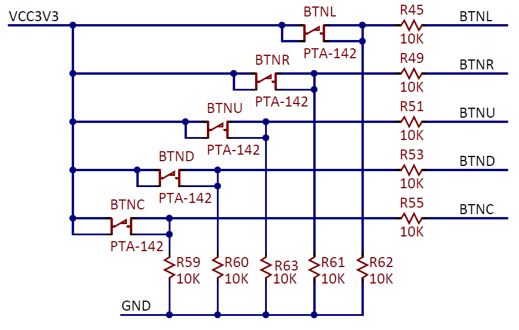
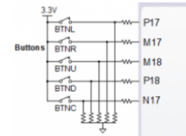
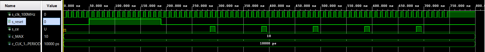
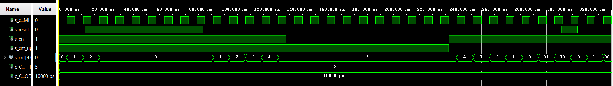
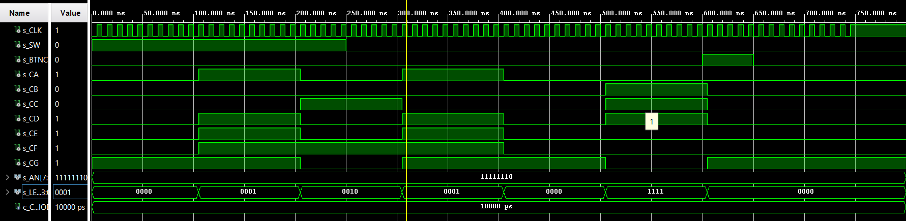
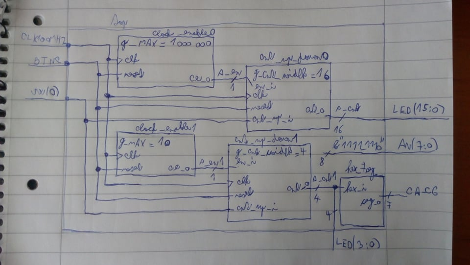

# Laboratory 5 - Binary counter

More information on [GitHub Tomáš Frýza](https://github.com/tomas-fryza/Digital-electronics-1/tree/master/Labs/05-counter)

[My GitHub](https://github.com/PetrDockalik/Digital-electronics-1)

## Preparation of Laboratory

[Nexys FPGA](https://reference.digilentinc.com/reference/programmable-logic/nexys-a7/start)




Tlačítka jsou zapojena jako active-high, tudíž při stisku je na pinu FPGA logická '1' a při nestisknutým tlačítku '0'.

Jedna perioda: Tclk = 10 ns

| **Time interval** | **Number of clk periods** | **Number of clk periods in hex** | **Number of clk periods in binary** |
| :-: | :-: | :-: | :-: |
| 2&nbsp;ms | 200 000 | `x"3_0d40"` | `b"0011_0000_1101_0100_0000"` |
| 4&nbsp;ms | 400 000 | `x"6_1A80"` | `b"0110_0001_1010_1000_0000"` |
| 10&nbsp;ms | 1 000 000 | `x"F_4240"` | `b"1111_0100_0010_0100_0000"` |
| 250&nbsp;ms | 25 000 000 | `x"17D_7840"` | `b"0001_0111_1101_0111_1000_0100_0000"` |
| 500&nbsp;ms | 50 000 000 | `x"2FA_F080"` | `b"0010_1111_1010_1111_0000_1000_0000"` |
| 1&nbsp;sec | 100 000 000 | `x"5F5_E100"` | `b"0101_1111_0101_1110_0001_0000_0000"` |

## Laboratory and Simulation

### Block: Clock_enable



### Block: Bidirectional counter

```vhdl
p_cnt_up_down : process(clk)
    begin
        if rising_edge(clk) then
        
            if (reset = '1') then               -- Synchronous reset
                s_cnt_local <= (others => '0'); -- Clear all bits

            elsif (en_i = '1') then       -- Test if counter is enabled

                if (cnt_up_i = '1') then          -- If it enabled, testing direction    
                s_cnt_local <= s_cnt_local + 1;     --Logic one in cnt_up_i is counter up
        
                elsif (cnt_up_i = '0') then
                s_cnt_local <= s_cnt_local - 1;     --Logic zero in cnt_up_i is counter down
                
                end if;
 
            end if;
        end if;
    end process p_cnt_up_down;
```

```vhdl
p_stimulus : process
    begin
        report "Stimulus process started" severity note;

        -- Enable counting
        s_en     <= '1';
        
        -- Change counter direction
        s_cnt_up <= '1';
        wait for 140 ns;
        
        s_en     <= '0';
        wait for 100 ns;
        
        s_en     <= '1';
        s_cnt_up <= '0';
        wait for 220 ns;

        -- Disable counting
        s_en     <= '0';

        report "Stimulus process finished" severity note;
        wait;
    end process p_stimulus;
```



### Top

```vhdl
entity top is
    Port ( CLK100MHZ : in STD_LOGIC;    --  Main clock
           BTNC : in STD_LOGIC;         --  Synchronous reset
           SW : in STD_LOGIC_VECTOR (1-1 downto 0);           --  Counter direction
           LED : out STD_LOGIC_VECTOR (4-1 downto 0);      --  Counter value LED indicators
           -- NOTE: For 16- bit counter, change LED on 16-1 downto 0 --
           CA : out STD_LOGIC;   --  Cathod A
           CB : out STD_LOGIC;   --  Cathod B
           CC : out STD_LOGIC;   --  Cathod C
           CD : out STD_LOGIC;   --  Cathod D
           CE : out STD_LOGIC;   --  Cathod E
           CF : out STD_LOGIC;   --  Cathod F
           CG : out STD_LOGIC;   --  Cathod G
           AN : out STD_LOGIC_VECTOR (8-1 downto 0));      --  Common anode signals to individual displays
end top;

------------------------------------------------------------------------
-- Architecture body for top level
------------------------------------------------------------------------
architecture Behavioral of top is

    -- Internal clock enable
    signal s_en  : std_logic;
    -- Internal counter
    signal s_cnt : std_logic_vector(4 - 1 downto 0); -- 4-bit counter
    -- NOTE: For 16- bit counter, change signal s_cnt on 16-1 downto 0 --

begin

    --------------------------------------------------------------------
    -- Instance (copy) of clock_enable entity
    clk_en0 : entity work.clock_enable
        generic map(
            g_MAX => 10 -- 10 period to generate 1 enable signal
        )
        port map(
            clk   => CLK100MHZ,     -- Main clock
            reset => BTNC,          -- Synchronous reset
            ce_o  => s_en           -- Clock enable pulse signal
        );

    --------------------------------------------------------------------
    -- Instance (copy) of cnt_up_down entity
    bin_cnt0 : entity work.cnt_up_down
        generic map(
            g_CNT_WIDTH => 4      -- Number of bits for counter
            -- NOTE: For 16- bit counter, change g_CNT_WIDTH on 16
        )
        port map(
            clk      => CLK100MHZ,       -- Main clock
            reset    => BTNC,            -- Synchronous reset
            en_i     => s_en,            -- Enable input
            cnt_up_i => SW(0),              -- Direction of the counter
            cnt_o    => s_cnt
        );

    -- Display input value on LEDs
    LED(3 downto 0) <= s_cnt;
    
    --------------------------------------------------------------------
    -- Instance (copy) of hex_7seg entity
    hex2seg : entity work.hex_7seg
        port map(
            hex_i    => s_cnt,
            seg_o(6) => CA,
            seg_o(5) => CB,
            seg_o(4) => CC,
            seg_o(3) => CD,
            seg_o(2) => CE,
            seg_o(1) => CF,
            seg_o(0) => CG
        );

    -- Connect one common anode to 3.3V
    AN <= b"1111_1110";

end architecture Behavioral;
```



### Entity jsem nekopíroval, ale jen poznačil v implement designu

