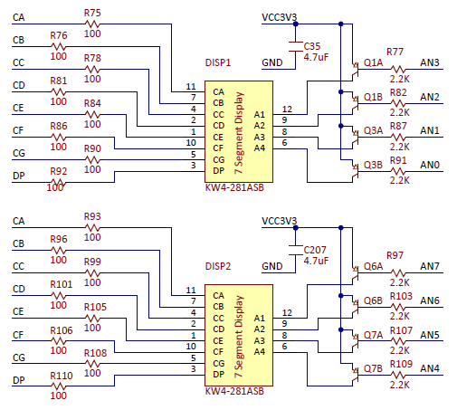
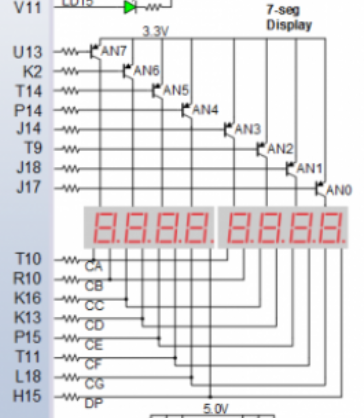
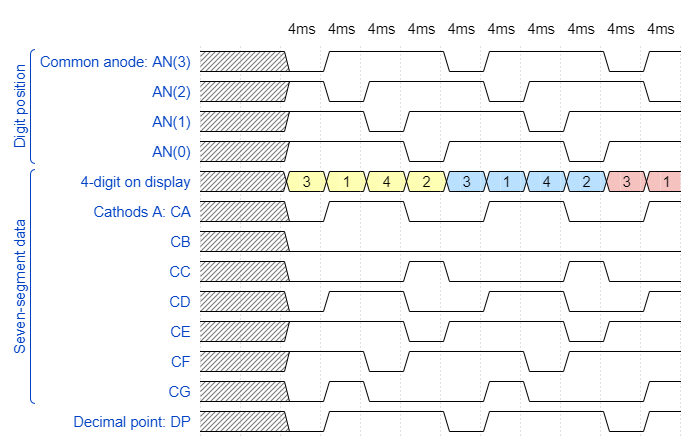

# Laboratory 6 - Display driver

More information on [GitHub Tomáš Frýza](https://github.com/tomas-fryza/Digital-electronics-1/tree/master/Labs/06-display_driver)

[My GitHub](https://github.com/PetrDockalik/Digital-electronics-1)

## Preparation of Laboratory

[WaveDrom](https://wavedrom.com/editor.html)





```javascript
{
  signal:
  [
    ['Digit position',
      {name: 'Common anode: AN(3)', wave: 'xx01..01..01'},
      {name: 'AN(2)', wave: 'xx101..01..0'},
      {name: 'AN(1)', wave: 'xx1.01..01..'},
      {name: 'AN(0)', wave: 'xx1..01..01.'},
    ],
    ['Seven-segment data',
      {name: '4-digit on display', wave: 'xx3333555599', data: ['3','1','4','2','3','1','4','2','3','1']},
      {name: 'Cathods A: CA', wave: 'xx01.0.1.0.1'},
      {name: '			 CB', wave: 'xx0.........'},
      {name: '			 CC', wave: 'xx0..10..10.'},
      {name: '			 CD', wave: 'xx01.0.1.0.1'},
      {name: '			 CE', wave: 'xx1..01..01.'},
      {name: '			 CF', wave: 'xx1.01..01..'},
      {name: '			 CG', wave: 'xx010..10..1'},
    ],
    {name: 'Decimal point: DP', wave: 'xx01..01..01'},
  ],
  head:
  {
    text: '                    4ms   4ms   4ms   4ms   4ms   4ms   4ms   4ms   4ms   4ms',
  },
}
```



## Laboratory