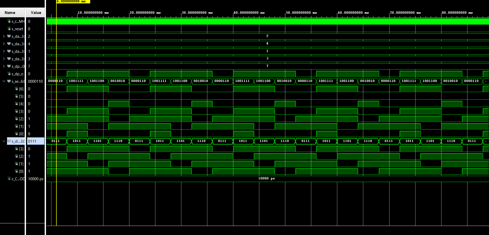
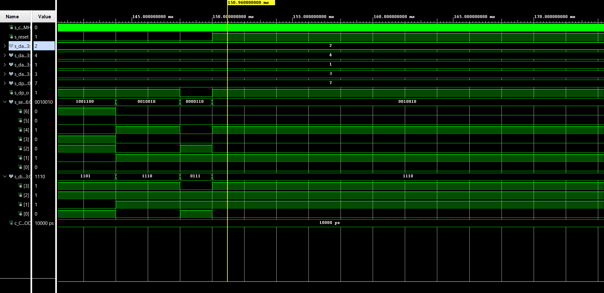
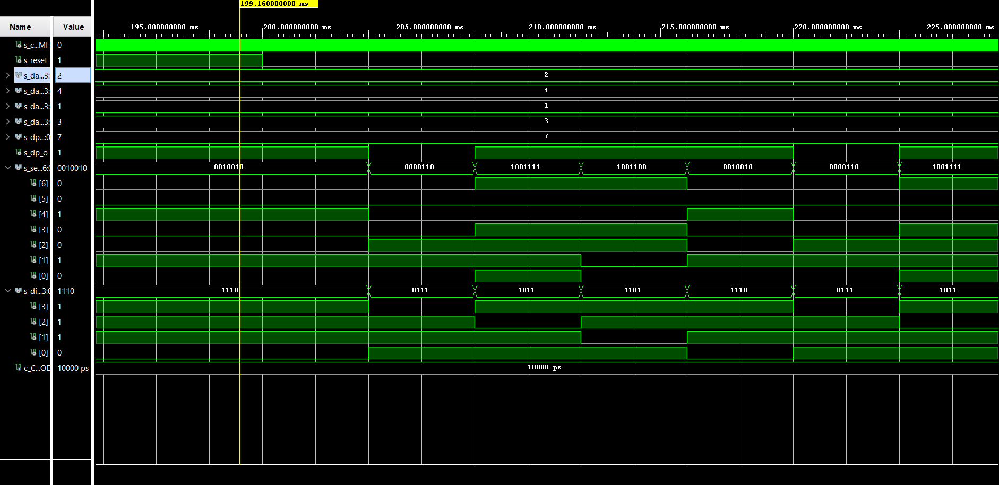
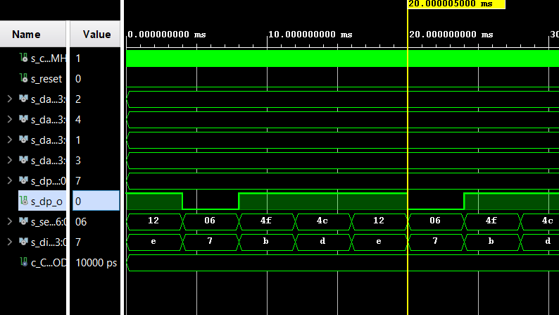
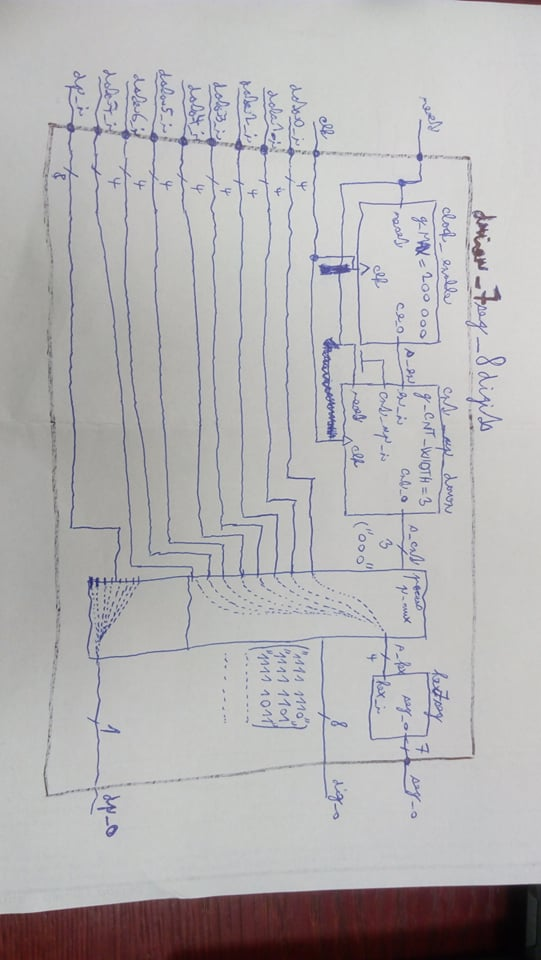

# Laboratory 6 - Display driver

More information on [GitHub Tomáš Frýza](https://github.com/tomas-fryza/Digital-electronics-1/tree/master/Labs/06-display_driver)

[My GitHub](https://github.com/PetrDockalik/Digital-electronics-1)

## Preparation of Laboratory

[WaveDrom](https://wavedrom.com/editor.html)


```javascript
{
  signal:
  [
    ['Digit position',
      {name: 'Common anode: AN(3)', wave: 'xx01..01..01'},
      {name: 'AN(2)', wave: 'xx101..01..0'},
      {name: 'AN(1)', wave: 'xx1.01..01..'},
      {name: 'AN(0)', wave: 'xx1..01..01.'},
    ],
    ['Seven-segment data',
      {name: '4-digit on display', wave: 'xx3333555599', data: ['3','1','4','2','3','1','4','2','3','1']},
      {name: 'Cathods A: CA', wave: 'xx01.0.1.0.1'},
      {name: '			 CB', wave: 'xx0.........'},
      {name: '			 CC', wave: 'xx0..10..10.'},
      {name: '			 CD', wave: 'xx01.0.1.0.1'},
      {name: '			 CE', wave: 'xx1..01..01.'},
      {name: '			 CF', wave: 'xx1.01..01..'},
      {name: '			 CG', wave: 'xx010..10..1'},
    ],
    {name: 'Decimal point: DP', wave: 'xx01..01..01'},
  ],
  head:
  {
    text: '                    4ms   4ms   4ms   4ms   4ms   4ms   4ms   4ms   4ms   4ms',
  },
}
```


## Laboratory

### Driver.vhd

```vhdl
p_mux : process(s_cnt, data0_i, data1_i, data2_i, data3_i, dp_i)
    begin
        case s_cnt is
            when "11" =>
                s_hex <= data3_i;
                dp_o  <= dp_i(3);
                dig_o <= "0111";

            when "10" =>
                s_hex <= data2_i;
                dp_o  <= dp_i(2);
                dig_o <= "1011";

            when "01" =>
                s_hex <= data1_i;
                dp_o  <= dp_i(1);
                dig_o <= "1101";

            when others =>
                s_hex <= data0_i;
                dp_o  <= dp_i(0);
                dig_o <= "1110";
        end case;
    end process p_mux;
```

### Testbench_driver.vhd

```vhdl
------------------------------------------------------------------------
--
-- Template for 4-digit 7-segment display driver testbench.
-- Nexys A7-50T, Vivado v2020.1.1, EDA Playground
--
-- Copyright (c) 2020-Present Tomas Fryza
-- Dept. of Radio Electronics, Brno University of Technology, Czechia
-- This work is licensed under the terms of the MIT license.
--
------------------------------------------------------------------------

library ieee;
use ieee.std_logic_1164.all;

------------------------------------------------------------------------
-- Entity declaration for testbench
------------------------------------------------------------------------
entity tb_driver_7seg_4digits is
    -- Entity of testbench is always empty
end entity tb_driver_7seg_4digits;

------------------------------------------------------------------------
-- Architecture body for testbench
------------------------------------------------------------------------
architecture testbench of tb_driver_7seg_4digits is

    -- Local constants
    constant c_CLK_100MHZ_PERIOD : time    := 10 ns;

    --Local signals
    signal s_clk_100MHz : std_logic;
    signal s_reset   : std_logic;
    signal s_data0_i : std_logic_vector(4 - 1 downto 0);
    signal s_data1_i : std_logic_vector(4 - 1 downto 0);
    signal s_data2_i : std_logic_vector(4 - 1 downto 0);
    signal s_data3_i : std_logic_vector(4 - 1 downto 0);
    signal s_dp_i    : std_logic_vector(4 - 1 downto 0);
    signal s_dp_o    : std_logic;
    signal s_seg_o   : std_logic_vector(7 - 1 downto 0);
    signal s_dig_o   : std_logic_vector(4 - 1 downto 0);

begin
    -- Connecting testbench signals with driver_7seg_4digits entity
    -- (Unit Under Test)
    uut_cnt : entity work.driver_7seg_4digits
        port map(
            clk     => s_clk_100MHz,
            reset   => s_reset,
            data0_i => s_data0_i,
            data1_i => s_data1_i,
            data2_i => s_data2_i,
            data3_i => s_data3_i,
            dp_i    => s_dp_i,
            dp_o    => s_dp_o,
            seg_o   => s_seg_o,
            dig_o   => s_dig_o
        );

    --------------------------------------------------------------------
    -- Clock generation process
    --------------------------------------------------------------------
    p_clk_gen : process
    begin
        while now < 750 ms loop         -- 75 periods of 100MHz clock
            s_clk_100MHz <= '0';
            wait for c_CLK_100MHZ_PERIOD / 2;
            s_clk_100MHz <= '1';
            wait for c_CLK_100MHZ_PERIOD / 2;
        end loop;
        wait;
    end process p_clk_gen;

    --------------------------------------------------------------------
    -- Reset generation process
    --------------------------------------------------------------------
    p_reset_gen : process
    begin
        s_reset <= '0';
        wait for 150 ms;
        
        -- Reset activated
        s_reset <= '1';
        wait for 50 ms;

        s_reset <= '0';
        wait for 100 ms;
        
        s_reset <= '1';
        wait for 35 ms;
        
        s_reset <= '0';
        wait;
    end process p_reset_gen;

    --------------------------------------------------------------------
    -- Data generation process
    --------------------------------------------------------------------
    p_stimulus : process
    begin
        report "Stimulus process started" severity note;
        
        s_dp_i <= "0111";
        s_data0_i <= "0010";
       
        s_data1_i <= "0100";
       
        s_data2_i <= "0001";

        s_data3_i <= "0011";

        report "Stimulus process finished" severity note;
        wait;
    end process p_stimulus;

end architecture testbench;
```

### Simulace



### Simulace před resetem



### Simulace po resetu



### Simulace clock_enable 4ms

Jasně vidíme, že do 20ms se nám displej 5x změnil.



### Top.vhd

```vhdl
----------------------------------------------------------------------------------
-- Company: 
-- Engineer: 
-- 
-- Create Date: 22.03.2021 15:55:36
-- Design Name: 
-- Module Name: top - Behavioral
-- Project Name: 
-- Target Devices: 
-- Tool Versions: 
-- Description: 
-- 
-- Dependencies: 
-- 
-- Revision:
-- Revision 0.01 - File Created
-- Additional Comments:
-- 
----------------------------------------------------------------------------------


library IEEE;
use IEEE.STD_LOGIC_1164.ALL;

-- Uncomment the following library declaration if using
-- arithmetic functions with Signed or Unsigned values
--use IEEE.NUMERIC_STD.ALL;

-- Uncomment the following library declaration if instantiating
-- any Xilinx leaf cells in this code.
--library UNISIM;
--use UNISIM.VComponents.all;

entity top is
    Port ( CLK100MHZ : in STD_LOGIC;                  -- Main clock
           BTNC : in STD_LOGIC;                       -- Synchronous reset
           SW : in STD_LOGIC_VECTOR (16-1 downto 0);  -- Four 4-bit values
           CA : out STD_LOGIC;                        -- Cathod A
           CB : out STD_LOGIC;                        -- Cathod B
           CC : out STD_LOGIC;                        -- Cathod C
           CD : out STD_LOGIC;                        -- Cathod D
           CE : out STD_LOGIC;                        -- Cathod E
           CF : out STD_LOGIC;                        -- Cathod F
           CG : out STD_LOGIC;                        -- Cathod G
           DP : out STD_LOGIC;                        -- Decimal point
           AN : out STD_LOGIC_VECTOR (8-1 downto 0)); -- Common anode signals  to individual displays
end top;

------------------------------------------------------------------------
-- Architecture body for top level
------------------------------------------------------------------------
architecture Behavioral of top is
    -- No internal signals
begin

    --------------------------------------------------------------------
    -- Instance (copy) of driver_7seg_4digits entity
    driver_seg_4 : entity work.driver_7seg_4digits
        port map(
            clk        => CLK100MHZ,
            reset      => BTNC,
            data3_i(3) => SW(15),
            data3_i(2) => SW(14),
            data3_i(1) => SW(13),
            data3_i(0) => SW(12),
            data2_i(3) => SW(11),
            data2_i(2) => SW(10),
            data2_i(1) => SW(9),
            data2_i(0) => SW(8),
            data1_i(3) => SW(7),
            data1_i(2) => SW(6),
            data1_i(1) => SW(5),
            data1_i(0) => SW(4),
            data0_i(3) => SW(3),
            data0_i(2) => SW(2),
            data0_i(1) => SW(1),
            data0_i(0) => SW(0),
            dp_i => "0111",
            dp_o   =>DP, 
            seg_o(6)  =>CA,
            seg_o(5)  =>CB,
            seg_o(4)  =>CC,
            seg_o(3)  =>CD,
            seg_o(2)  =>CE,
            seg_o(1)  =>CF,
            seg_o(0)  =>CG, 
            dig_o(3)  =>AN(3),
            dig_o(2)  =>AN(2),
            dig_o(1)  =>AN(1),
            dig_o(0)  =>AN(0)
        );

    -- Disconnect the top four digits of the 7-segment display
    AN(7 downto 4) <= b"1111";

end architecture Behavioral;
```

### 8-digit driver

Raději jsem zvolil clock_enable 2ms, protože při 4ms by to už mohlo jít poznat.

