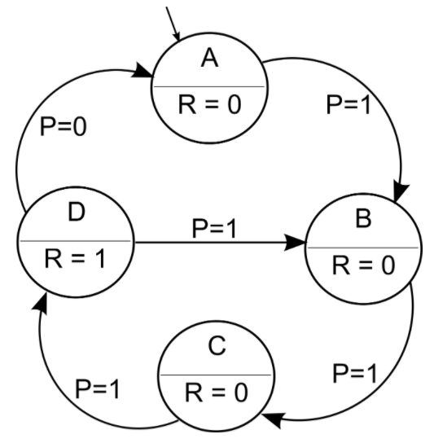
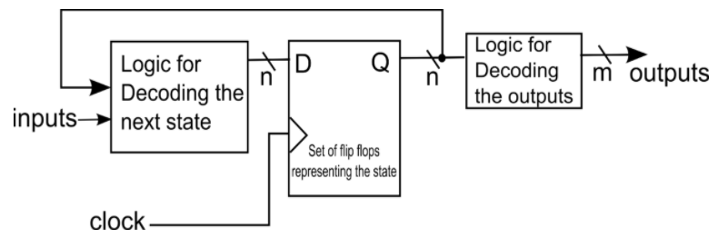
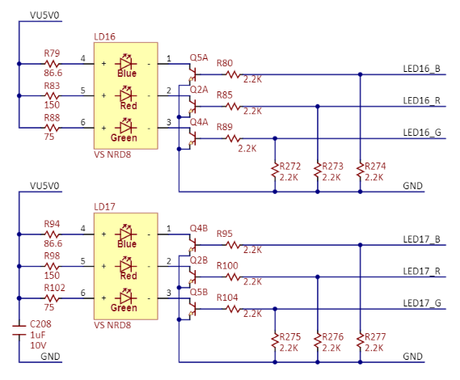
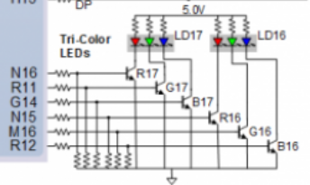
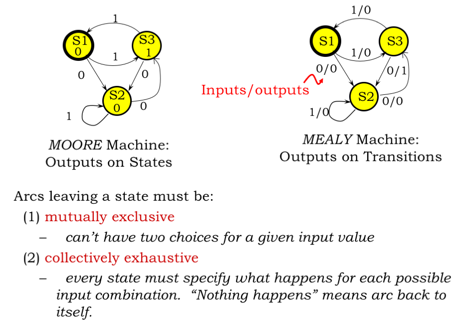
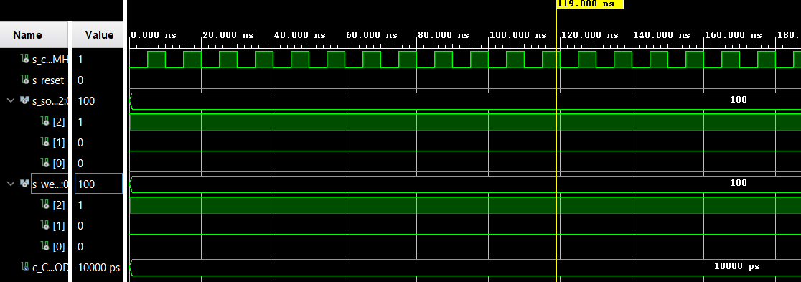
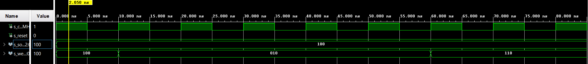
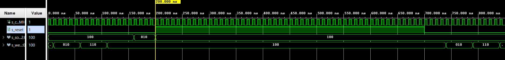
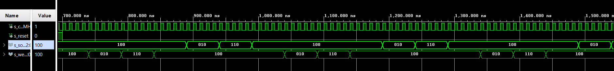

# Laboratory 8 - Traffic light controller

More information on [GitHub Tomáš Frýza](https://github.com/tomas-fryza/Digital-electronics-1/tree/master/Labs/08-traffic_lights)

[My GitHub](https://github.com/PetrDockalik/Digital-electronics-1)

## Preparation of Laboratory



| **Input P** | `0` | `0` | `1` | `1` | `0` | `1` | `0` | `1` | `1` | `1` | `1` | `0` | `0` | `1` | `1` | `1` |
| :-- | :-: | :-: | :-: | :-: | :-: | :-: | :-: | :-: | :-: | :-: | :-: | :-: | :-: | :-: | :-: | :-: |
| **Clock** |  |  |  |  |  |  |  |  |  |  |  |  |  |  |  |  |
| **State**    | A   | A   | B   | C   | C   | D   | A   | B   | C   | D   | A   | A   | B   | C   | D   | B  |
| **Output R** | `0` | `0` | `0` | `0` | `0` | `1` | `0` | `0` | `0` | `1` | `0` | `0` | `0` | `0` | `1` | `0` |







| **RGB LED** | **Artix-7 pin names** | **Red** | **Yellow** | **Green** |
| :-: | :-: | :-: | :-: | :-: |
| LD16 | N15, M16, R12 | `1,0,0` | `1,1,0` | `0,1,0` |
| LD17 | N16, R11, G14 | `1,0,0` | `1,1,0` | `0,1,0` |

About Finite State Machine: [[1]](https://ocw.mit.edu/courses/electrical-engineering-and-computer-science/6-004-computation-structures-spring-2017/c6/c6s1/)
[[2]](https://www.youtube.com/watch?v=6_Rotnw1hFM&ab_channel=LBEbooks)
[[3]](https://vhdlwhiz.com/n-process-state-machine/)

Dva typy: Mealy-děje závisí na aktuálním stavu a vstupech.
Moore-výstupy závisí pouze na aktuálním stavu a nikoli na vstupech



## Laboratory

| **Current state** | **Direction South** | **Direction West** | **Delay** |
| :-- | :-: | :-: | :-: |
| `STOP1`      | red    | red | 1 sec |
| `WEST_GO`    | red    | green | 4 sec |
| `WEST_WAIT`  | red    | yellow | 2 sec |
| `STOP2`      | red    | red | 1 sec |
| `SOUTH_GO`   | green  | red | 4 sec |
| `SOUTH_WAIT` | yellow | red | 2 sec |


### tlc.vhdl

Z prvního pohledu vidíme, že stavy jdou po sobě tak jak mají v každé ukázce simulace.



Pro snadnější simulaci jsme obešli clock_enable a využili periodu 10ns přímo od kmitočtu 100MHz.



Reset také odpovídá, při resetu je provoz na křižovatce zastaven.





```vhdl
p_traffic_fsm : process(clk)
    begin
        if rising_edge(clk) then
            if (reset = '1') then       -- Synchronous reset
                s_state <= STOP1 ;      -- Set initial state
                s_cnt   <= c_ZERO;      -- Clear all bits

            elsif (s_en = '1') then
                -- Every 250 ms, CASE checks the value of the s_state 
                -- variable and changes to the next state according 
                -- to the delay value.
                case s_state is

                    -- If the current state is STOP1, then wait 1 sec
                    -- and move to the next GO_WAIT state.
                    when STOP1 =>
                        -- Count up to c_DELAY_1SEC
                        if (s_cnt < c_DELAY_1SEC) then
                            s_cnt <= s_cnt + 1;
                        else
                            -- Move to the next state
                            s_state <= WEST_GO;
                            -- Reset local counter value
                            s_cnt   <= c_ZERO;
                        end if;

                    when WEST_GO =>
                        -- Count up to c_DELAY_4SEC
                        if (s_cnt < c_DELAY_4SEC) then
                            s_cnt <= s_cnt + 4;
                        else
                            -- Move to the next state
                            s_state <= WEST_WAIT;
                            -- Reset local counter value
                            s_cnt   <= c_ZERO;
                        end if;
                    when WEST_WAIT =>
                        -- Count up to c_DELAY_2SEC
                        if (s_cnt < c_DELAY_2SEC) then
                            s_cnt <= s_cnt + 2;
                        else
                            -- Move to the next state
                            s_state <= STOP2;
                            -- Reset local counter value
                            s_cnt   <= c_ZERO;
                        end if;
                    when STOP2 =>
                        -- Count up to c_DELAY_1SEC
                        if (s_cnt < c_DELAY_1SEC) then
                            s_cnt <= s_cnt + 1;
                        else
                            -- Move to the next state
                            s_state <= SOUTH_GO;
                            -- Reset local counter value
                            s_cnt   <= c_ZERO;
                        end if;
                    when SOUTH_GO =>
                        -- Count up to c_DELAY_4SEC
                        if (s_cnt < c_DELAY_4SEC) then
                            s_cnt <= s_cnt + 4;
                        else
                            -- Move to the next state
                            s_state <= SOUTH_WAIT;
                            -- Reset local counter value
                            s_cnt   <= c_ZERO;
                        end if;
                    when SOUTH_WAIT =>
                        -- Count up to c_DELAY_2SEC
                        if (s_cnt < c_DELAY_2SEC) then
                            s_cnt <= s_cnt + 2;
                        else
                            -- Move to the next state
                            s_state <= STOP1;
                            -- Reset local counter value
                            s_cnt   <= c_ZERO;
                        end if;
                    -- It is a good programming practice to use the 
                    -- OTHERS clause, even if all CASE choices have 
                    -- been made. 
                    when others =>
                        s_state <= STOP1;

                end case;
            end if; -- Synchronous reset
        end if; -- Rising edge
    end process p_traffic_fsm;
```

```vhdl
p_output_fsm : process(s_state)
    begin
        case s_state is
            when STOP1 => --South and west RED
                south_o <= c_RED;
                west_o  <= c_RED;
            when WEST_GO => --West green
                south_o <= c_RED;
                west_o  <= c_GREEN;
            when WEST_WAIT => --West slow down 
                south_o <= c_RED;
                west_o  <= c_YELLOW;
            when STOP2 => --South and west RED
                south_o <= c_RED;
                west_o  <= c_RED;
            when SOUTH_GO => --South green
                south_o <= c_GREEN;
                west_o  <= c_RED;
            when SOUTH_WAIT => --South slow down
                south_o <= c_YELLOW; 
                west_o  <= c_RED;
            when others => --South and west RED
                south_o <= c_RED;
                west_o  <= c_RED;
        end case;
    end process p_output_fsm;
```

### top.vhdl

| **Port name** | **Direction** | **Type** | **Description** |
| :-: | :-: | :-: | :-- |
| `CLK100MHZ` | input | `std_logic` | Main clock |
| `BTNC` | input | `std_logic` | Synchronous reset |
| `LED16_R` | output | `std_logic` | Red1 |
| `LED16_G` | output | `std_logic` | Green1 |
| `LED16_B` | output | `std_logic` | Blue1 |
| `LED17_R` | output | `std_logic` | Red2 |
| `LED17_G` | output | `std_logic` | Green2 |
| `LED17_B` | output | `std_logic` | Blue2 |

### Smart controller

| **Current state** | **Direction South** | **Direction West** | **Delay** |
| :-- | :-: | :-: | :-: |
| `STOP`      		| red    | red | 1 sec |
| `STOP_WEST`     	| red    | red | 1 sec |
| `STOP_SOUSTH`    	| red    | red | 1 sec |
| `GO`    		| green  	| green | 1 sec |
| `WEST_GO`    		| red    | green | 4 sec |
| `WEST_WAIT`  		| red    | yellow | 2 sec |
| `SOUTH_GO`   		| green  | red | 4 sec |
| `SOUTH_WAIT` 		| yellow | red | 2 sec |


```vhdl
p_smart_traffic_fsm : process(clk)
    begin
        if rising_edge(clk) then
            if (reset = '1') then
                s_state <= STOP;
                s_cnt   <= c_ZERO;
            elsif (s_en = '1') then
                case s_state is
                    when STOP =>
                        if (s_cnt < c_DELAY_1SEC) then
                            s_cnt <= s_cnt + 1;
                        elsif (south_i = '0' and west_i = '0') then
                            s_state <= GO;
                            s_cnt   <= c_ZERO;
                        elsif (south_i = '1' and west_i = '0') then
                            s_state <= GO_WEST;
                            s_cnt   <= c_ZERO;
                        elsif (south_i = '1' and west_i = '1') then
                            s_state <= GO_WEST;
                            s_cnt   <= c_ZERO;
                        elsif (south_i = '0' and west_i = '1') then
                            s_state <= GO_SOUTH;
                            s_cnt   <= c_ZERO;
                        end if;
                    when STOP_SOUTH =>
                        if (s_cnt < c_DELAY_1SEC) then
                            s_cnt <= s_cnt + 1;
                        else
                            s_state <= GO_WEST;
                            s_cnt   <= c_ZERO;
                        end if;
                    when STOP_WEST =>
                        if (s_cnt < c_DELAY_1SEC) then
                            s_cnt <= s_cnt + 1;
                        else
                            s_state <= GO_SOUTH;
                            s_cnt   <= c_ZERO;
                        end if;
                    when WAIT_WEST =>
                        if (s_cnt < c_DELAY_2SEC) then
                            s_cnt <= s_cnt + 2;
                        else
                            s_state <= STOP_WEST;
                            s_cnt   <= c_ZERO;
                        end if;
                    when WAIT_SOUTH =>
                        if (s_cnt < c_DELAY_2SEC) then
                            s_cnt <= s_cnt + 2;
                        else
                            s_state <= STOP_SOUTH;
                            s_cnt   <= c_ZERO;
                        end if;
                    when GO =>
                        if (s_cnt < c_DELAY_1SEC) then
                            s_cnt <= s_cnt + 1;
                        elsif (south_i = '0' and west_i = '0') then
                            s_state <= GO;
                            s_cnt   <= c_ZERO;
                        elsif (south_i = '1' and west_i = '0') then
                            s_state <= WAIT_SOUTH;
                            s_cnt   <= c_ZERO;
                        elsif (south_i = '1' and west_i = '1') then
                            s_state <= WAIT_SOUTH;
                            s_cnt   <= c_ZERO;
                        elsif (south_i = '0' and west_i = '1') then
                            s_state <= WAIT_WEST;
                            s_cnt   <= c_ZERO;
                        end if;
                    when GO_WEST =>
                        if (s_cnt < c_DELAY_4SEC) then
                            s_cnt <= s_cnt + 4;
                        elsif (south_i = '0' and west_i = '0') then
                            s_state <= GO;
                            s_cnt   <= c_ZERO;
                        elsif (south_i = '1' and west_i = '0') then
                            s_state <= GO_WEST;
                            s_cnt   <= c_ZERO;
                        elsif (south_i = '1' and west_i = '1') then
                            s_state <= WAIT_WEST;
                            s_cnt   <= c_ZERO;
                        elsif (south_i = '0' and west_i = '1') then
                            s_state <= WAIT_WEST;
                            s_cnt   <= c_ZERO;
                        end if;
                    when GO_SOUTH =>
                        if (s_cnt < c_DELAY_4SEC) then
                            s_cnt <= s_cnt + 4;
                        elsif (south_i = '0' and west_i = '0') then
                            s_state <= GO;
                            s_cnt   <= c_ZERO;
                        elsif (south_i = '1' and west_i = '0') then
                            s_state <= WAIT_SOUTH;
                            s_cnt   <= c_ZERO;
                        elsif (south_i = '1' and west_i = '1') then
                            s_state <= WAIT_SOUTH;
                            s_cnt   <= c_ZERO;
                        elsif (south_i = '0' and west_i = '1') then
                            s_state <= GO_SOUTH;
                            s_cnt   <= c_ZERO;
                        end if;
                    when others =>
                        s_state <= STOP;
                end case;
            end if;
        end if;
    end process p_smart_traffic_fsm;
```